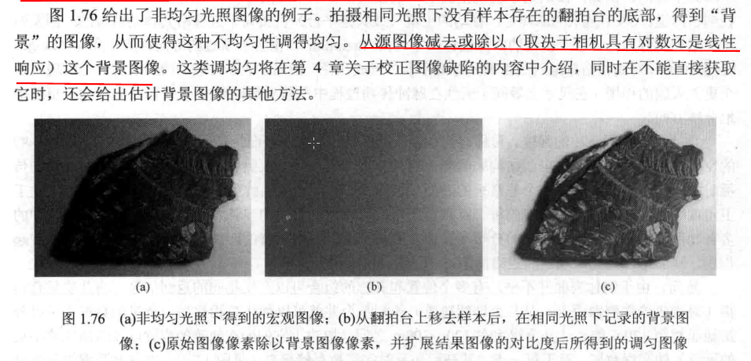
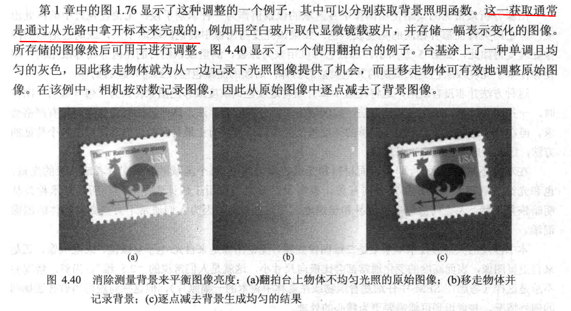
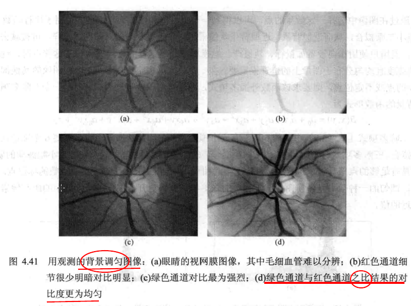
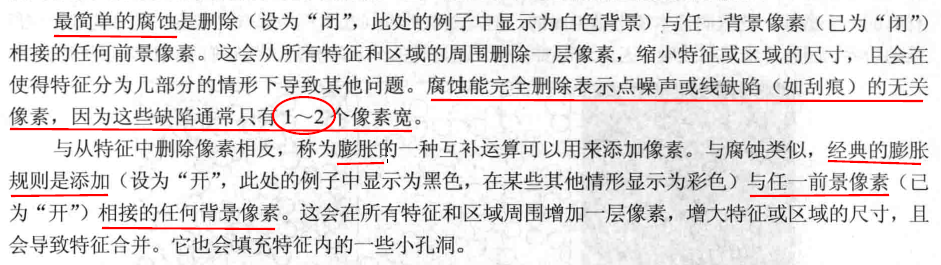
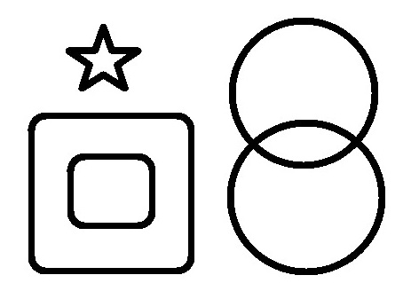
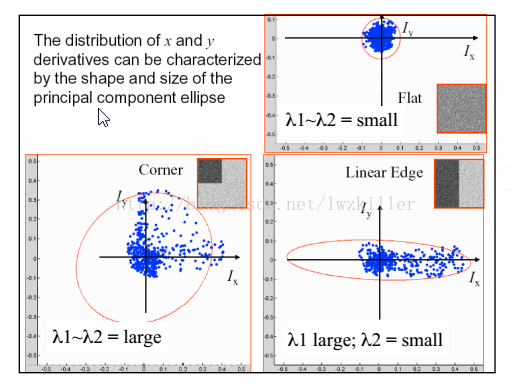
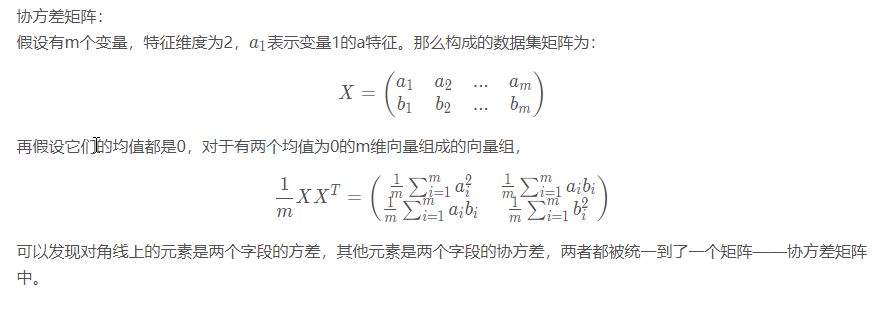
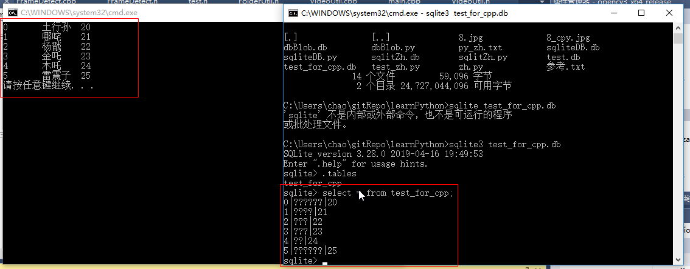

# 特征提取与图像处理（第二版）读书笔记

幅度描述的是每个频率分量的总量，而相位描述的是频率分量产生的时序（timing）

**相位谱：**基础的正弦波A.sin(wt+θ)中，振幅，频率，相位缺一不可，不同相位决定了波的位置，所以对于频域分析，仅仅有频谱（振幅谱）是不够的，我们还需要一个相位谱

复数的物理意义：

卷积的物理含义：
卷积的几个现实例子:蒸馒头/复利/打脸(参考知乎)
滤波器原理：

卷积是

一个信号p1(t)和另外一个信号p2(t)的卷积可以通过积分计算：

这是系统理论的基础，激励p1和系统响应p2 反转系统响应的时间轴得到记忆函数？？？？？

采样定理是美国电信工程师H.奈奎斯特在1928年提出的，在数字信号处理领域中，采样定理是连续时间信号（通常称为“模拟信号”）和离散时间信号（通常称为“数字信号”）之间的基本桥梁。该定理说明采样频率与[信号频谱](https://baike.baidu.com/item/%E4%BF%A1%E5%8F%B7%E9%A2%91%E8%B0%B1/8084448)之间的关系，是[连续信号](https://baike.baidu.com/item/%E8%BF%9E%E7%BB%AD%E4%BF%A1%E5%8F%B7/6597074)[离散化](https://baike.baidu.com/item/%E7%A6%BB%E6%95%A3%E5%8C%96/10501557)的基本依据。 它为采样率建立了一个足够的条件，该采样率允许离散采样序列从有限带宽的连续时间信号中捕获所有信息。

-------

**离散傅里叶变换**
为什么会出现离散傅里叶变化，具体可以参考如下两篇文章，关键点摘抄如下：

1. [如何通俗地解释什么是离散傅里叶变换？](https://www.zhihu.com/question/21314374)
***DTFT（离散时间傅里叶变换）是给人用的，DFT（离散傅里叶变换）是给机器用的，DFT是对DTFT的频域采样。***
2. [深入理解FT，DTFT，DFT 之间的关系](https://blog.csdn.net/weixin_40679412/article/details/80426463)

思考离散傅里叶变换怎么从一维推导到二维

数字图像处理.John C.Russ(第六版) 中第6章关于傅里叶变换的可以好好看看
建立一个基础概念非常重要，比如使用简单图像导出我们熟悉的频率空间变换的功率谱显示，比如傅里叶变换和逆傅里叶变换对等等

--------

2019年2月17日学习小结：
今天主要是在搜索引擎上专门找图像的导数（求导）的意义：关注下这个小伙的博客(https://blog.csdn.net/saltriver?t=1)，里面应该有几篇文章可以详细参考下
有空的话可以看下数字图像处理第三版（冈萨雷斯）第十章中的内容

搜索：行人检测、人形检测、人体检测

参考如下资源汇总：https://blog.csdn.net/qq_26898461/article/details/48262957

当当上的书籍：http://product.dangdang.com/23942207.html

另外一个书籍：基于单目视觉的智能汽车行人检测技术研究

硕士论文：朱文佳-基于机器学习的行人检测关键技术研究 （可以在这里在线免费阅读：http://www.doc88.com/p-0611669997404.html   ）

行人检测资源参考：https://blog.csdn.net/dreamhigh_m/article/details/70618768

---------

2019年2月19日：
总结下从2月11日到2月18日学习到的内容，输出一些总结：主要是如下几个：
1. 讲下离散傅里叶变换出现的原因、意义
2. 讲下一次导数、二次导数在数字图像处理中的原理和应用场景（主要参考下2月17日总结中提到的系列博客文章，仿照他的写作方法写几篇，同时继续仿照此风格，多写一些文章）
3. 讲下边缘检测
4. 储备下行人检测的知识，为后续学习做准备
5. 看下滤波器相关的知识

-----------
从今天起还是专注读这几本教材，优先读《数字图像处理.John C.Russ(第六版) 》，原因是这本书中数学公式少，大量插图实例多，便于概念理解，全书总共约600页，计划每天读10页（要求每天都要有对应的输出），60天读完，每天统计偏差，19年2月19日先读下绪论和看下整体书籍的目录结构
第一天（2019.2.19)：绪论，讲解了为啥要熟悉人类视觉和印刷技术
>为使工作尽可能最佳,知道所处理的图像将用于何处是很重要的。对于视觉增强而言,这意味着要在一定程度上熟悉人类视觉过程,并了解观察者对图像中的哪些线索有反应。关于人类视觉的一章涉及了这些问题。由于许多图像是在复制或传输的情况下进行处理的,因此了解图像的印刷或显示过程也会有帮助。随着数码相机用户数量的剧增,图像的印刷技术发展得非常快,本书提供了最新的相关信息。

第二天（2019.2.20)：接着看绪论和第一章的内容，后面不再摘抄大面积书上的内容，主要改为在书上做标记为主
绪论：图像处理的两个目的：1）***视觉增强*** 改进图像，便于呈现给人类观察  2）***图像测量***：通常是获取科学数据的主要方法，测量图像，并定义、揭示其特征与结构。特征和结构包括***边缘、亮度、色彩或者是他们的组合***，这样便于识别图中的关键点，比如人脸识别、行人识别等
第一章：**人类依赖图像获取信息** 人类主要是视觉动物，往往通过视觉发展更多的技术，很多科学任务，比如外太空探索、深海勘探等，相机都是作为主要的部件，这些任务的成功与否，通常由返回的图像质量决定。
另外，讲解了摄像机的历史：
1）原始视频相机（管式相机）：不同强度的光进入荧光涂粉层， 在荧光体上产生自由电子，这些操作改变了局部涂层的电导率，因此当电子束扫描时，流向阳极的电流大小会随着局部的光强而变化。此种相机的缺点：电磁场或者静电场扫描束会产生一种失真的扫描，造成枕形失真、虚光和失焦；优点：空间分辨率非常高，荧光粉有一种类似于人眼的谱响应，即可看到从红到蓝的颜色，用特殊涂层对相机进行改装，可以在非常暗淡的光线下获取图像（如夜景、荧光显微镜）

2）CCD(电荷耦合器件)相机：管式相机基本被固态芯片相机取代，固态芯片相机最原始且最简单的形式是CCD，后来CCD传感器又被更廉价的CMOS传感器替代，CCD传感器则在高端应用领域有优势，具体可以参见书上内容

第三天（2019.2.21): 加班太晚，12点到才到家，今天无进展，落下的进度本周要完成，从周二开始算，到本周日的目标是要学习完成60页。

第四天（2019.2.22）：

**关于噪声的一些阐述：**
下图的显示了高ASA设置（高放大增益）对图像中随机像素变化的效果，图像上半部分ASA 1600，下半部分100，通过对比表明相机中较高增益产生了较大的随机噪声。

**图像加法的其中一个意义**
下图显示了一幅荧光显微图像,其中的一个视频帧示出了大量的统计噪声,这一噪声妨碍了我们分辨或测量所呈现的结构。对多个帧进行平均处理会收集更多的信号,并可增强信噪比,进而提升细节的可视性。

增加曝光量(增大曝光时间、镜头光圈或光照)会因为统计效果而降低噪声。质量的提升与所收集的光(或其他信号)的数量的平方根成正比。

第四天（2019.2.23）：主要看了第一章第12节高深度图像：
从海平面到珠穆朗玛峰以8位(256个值)编码的地表高程图,对应于100英尺/位;在这样的地形图上,佛罗里达的绝大部分地区与海平面就很难区分。使用2字节像素(65536个值)时,每位约表示6英寸,在地图上可以分辨沿多数街道的路肩。使用4字节像素(40亿个值),每位所对应的小于200μm,这时甚至可记录海滩上沙子的粗糙度。
接着看了彩色图像这一节，SEM（扫描电子显微镜）通常是一种严格的单色成像工具，书中讲了使用彩色图像的几个意义：
1、使用伪彩色，一般目的是将原本的黑白图像中的某些亮度着上色，凸显其特征，便于人工观察，另外一个原因是人类视觉能力分辨亮度细微差别的能力。
2、使用色彩来对多维信息进行丰富的编码，如色彩通常用于对表面高程着色(见第15章)。在科学可视化中,色彩用于速度、密度、温度、成分和许多其他并不明显的属性。这些属性通常与图像的特性无关,只是简单地利用人的能力来区分比灰度值更多的色彩。
第四天（2019.2.24）：主要看了第一章第15节色彩空间：
RGB HSI等色彩空间的转换关系，另外说到了LUT查找表将彩色图像降到256色
第五天（2019.2.26）：主要对第一章第15节到这一章节末尾书上的内容做下简单摘要
多幅图像：1）对同一区域使用多种不同波长得到的同一区域的不同卫星图2）时间序列图，用于跟踪天气系统的一系列卫星图像
体视法：从相同场景的稍微不同角度拍摄的两幅图像中也可以获得三维信息，人的双眼成像原理
人类视觉是比较性的。
今天进入第二章的学习：人类视觉
在数字图像处理的书籍中花一章讲解人类视觉有两个主要原因。首先,许多图像处理涉及提高图像中细节及特征的可见度,而这取决人们对从图像中所看到(及所忽略)的内容的一些理解。其次,在后续章节描述的用于图像处理和场景中目标检测的许多算法,或多或少都基于我们对人类视觉处理如何工作的理解。
人类90%到95%的信息通过眼睛获得
人类视觉的不少目的是识别，寻找食物，躲避猎物，引起配偶注意等
图像的特性或者特征是人类识别物体的标志
人类视觉根源的基本技术是比较，眼睛感知不到物体具体尺寸、测量不出来亮度和颜色的具体值
第六天（2019.2.27）：今天主要以阅读书籍上的内容为主，在pdf文档上做了很多红线记录
第七天（2019.2.28）：今天主要以阅读书籍上的内容为主，在pdf文档上做了很多红线记录
第八天（2019.3.1）：今天主要以阅读书籍上的内容为主，在pdf文档上做了很多红线记录，今天结束了书中第二章的阅读。
第九天（2019.3.2）：今天主要以阅读书籍上的内容为主，在pdf文档上做了很多红线记录，阅读了第三章中的大部分内容
第十天（2019.3.4）：今天的主要目标是结束第三章的学习，Haar函数小波变换没有看懂，后面有机会再研究下。
帧间差分法C+代码：https://blog.csdn.net/lijia0129/article/details/25034253
https://blog.csdn.net/xiao__run/article/details/76849908
第十一天（2019.3.5）：今天开始正式进入第四章的学习，终于要进入正题了
第一节首先讲了对比度扩展，比如偏暗色的图片可以通过将图片中最亮值和最暗值对应的亮度区间线性映射到更大的亮度区间（比如0到255最广灰度空间）来增加明暗对比度，从而来调亮整体的图片。
第二节讲了噪声是图像中的很大缺陷，对比度线性扩展也会使得噪声增加。对于随机噪声，对一定数量的帧取平均，可以提升图像的质量（技术上为信噪比）。另外，对于相机来说，更长的曝光时间，更小的信号放大增益可以减少图像噪声。
第三节讲解了领域平均法，领域平均也可以使用非方形值，对于较大的领域，近似的圆形比方形好。接着讲解了高斯核，从文中所讲来看，高斯核也没有解决边缘模糊的问题。对于此问题的解决方案貌似是：在第5章关于图像增强的介绍中,给出了负权重值围绕一个正的中心峰值的核的用法。这一改动的目的是锐化边缘,并避免因消除噪声所引起的一些模糊。
第十二天（2019.3.6）：第四节讲解了领域排序，其中最广泛使用的方法是中值滤波器，中值滤波器相对于权重相乘平均方法有两个主要优点：1）该方法不会降低或者模糊各阶的亮度差异，2）其次，与平均操作不同，中值滤波不会使得边界移位
混合中值为什么能保留被传统中值滤波删除的线或磨圆的角呢？参考下面的图，后续慢慢想下

第5节其他领域降噪方法提到了顶帽滤波器，在第6节中会更详细的讲解介绍该滤波器对于不同目的的用法
第十三天（2019.3.7）：今天主要学习第6节的内容，缺陷消除：最大熵和最大似然，这一节完全没有看懂，后面在互联网上再搜集相关知识点进行学习吧，这里有一句关键的后面可以深入研究的话是：基于熵的计算机密集型方法，可消除如噪声或图像模糊之类的人为缺陷。我们家有个摄像头的图像是比较模糊的，看看能不能用这种方法消除图像模糊。另外也可以百度搜索关键字“数字图像处理 去模糊”来检索相关资料：https://wenku.baidu.com/view/955bd8347f21af45b307e87101f69e314332fa28.html
第十四天（2019.3.9）：今天主要以阅读书籍上的内容为主，在pdf文档上做了很多红线记录
第十五天（2019.3.13）：今天进入第5章的学习，空间域图像增强，直方图均衡看了书本上的公式完全不理解，参考了如下的帖子豁然开朗
https://www.cnblogs.com/tianyalu/p/5687782.html
第十六天（2019.3.17）：今天接着进行第5章的学习，重点学习了拉普拉斯算子和锐化算子。
提高细节和边缘可见性的一种更常用方法是反锐化掩模，书中的讲解加上下面一篇文档的参考可以更好地说明此方法的原理http://blog.sina.com.cn/s/blog_5a69abfb0101fsgh.html
线性反锐化掩模（UnSharp Masking，UM）算法。首先将原图像低通滤波后产生一个钝化模糊图像，将原图像与这模糊图像相减得到保留高频成份的图像，再将高频图像用一个参数放大后与原图像叠加，这就产生一个增强了边缘的图像。最初将原图像通过低通滤波器后，因为高频成份受到抑制，从而使图像模糊，所以模糊图像中高频成份有很大削弱。将原图像与模糊图像相减的结果就会使f(x、y)的低频成份损失很多，而高频成份较完整地被保留下来。因此，再将高频成份的图像用一个参数放大后与原图像f(x、y)叠加后，就提升了高频成份，而低频成份几乎不受影响。
第十七天（2019.3.18）：今天主要是复习之前学习到的内容，同时查下互联网上关于梯度的一些概念，参考这篇文档：方向导数与梯度http://netedu.xauat.edu.cn/jpkc/netedu/jpkc/gdsx/homepage/5jxsd/51/513/5308/530807.htm
很多时候要考虑多元函数沿任意方向的变化率，那么就引出了方向导数
各种算子的如何推导出来的参考如下文章：梯度与Roberts、Prewitt、Sobel、Lapacian算子
https://blog.csdn.net/swj110119/article/details/51777422
上面的这篇文章里面的有些算子的方向错了，还有一些可能不正确，具体可以再参考下面的这篇文章做一些纠正
https://blog.csdn.net/gdut2015go/article/details/46779251
第十八天（2019.3.19）：今天主要是思考导数的几何含义，尤其是要弄明白三维空间中梯度的含义
参考下这篇文档：https://blog.csdn.net/czmacd/article/details/81178650 貌似下面的这个图可以稍微给点灵感

第十九天（2019.3.20）：关于梯度我还要在写一篇专题贴，介绍从二维函数的导数到三维引出方向导数，以及推演出来了方向导数沿梯度方向时值最大，另外，同时推导出梯度和等高线的关系

第二十天（2019.3.21）：这里遗留了5,8节纹理和5.9节分形的简单介绍没有细看，现在也看不懂，等到后面的章节详细讲了这两部分内容之后再看吧
另外，图像相减的意义理解了，但是图像相乘和相除能干啥还是看不懂啊，作为遗留问题吧
另外，主成分分析也作为遗留问题后续继续研究

第二十一天（2019.3.22）：今天开始进行第六章的学习，频率空间中的图像处理，这里面很多简单的图像都具备启发式
第二十二天（2019.3.23）：今天继续进行第六章的学习，要搞明白相位的物理含义；另外需要搞明白什么是衍射图样，它为啥会丢失相位信息
第二十三天（2019.3.24）：最近要弄清楚怎么从一维傅里叶变换推导出二维傅里叶变换以及相位的物理含义；
先找几个可以画数学图形的软件，这样便于学习一些抽象的概念，参考：http://www.360doc.com/content/15/0318/22/55856_456286702.shtml
从这个帖子里面提取一些信息是：计算机系的一般觉得python的matplotlib画出来的图像比较好（相比mathmaticas或者matlab等），同时指出matplotlib 3维绘制效果差点，有性能方面的原因，可能也有图像不够精细等各方面的原因吧，建议3D绘图使用mayavi这个库比较好。
这里有个帖子讲到了相位，负频率的物理含义，挺通俗的，可以看下：
https://www.zhihu.com/question/20977844/answer/66532717
傅立叶变换的确有明确的物理意义：把一个信号（时间轴上从负无穷到正无穷）分解为无数个角速度不同（遍历所有 实数）的圆周运动（该圆周运动发生在复平面）。所以，题主问的傅立叶变换的相位是什么含义？就是在t=0时刻，角速度为w的圆周运动所在的弧度。  另外一个让很多初学者百撕不得其解的 问题：傅立叶变换的负频率有什么含义？  答案是：正频率代表了逆时针的圆周运动，负频率代表了顺时针的圆周运动。就这么简单。  所以，一个实函数的傅立叶分解，必然是一对（或无数对）频率正负相反的圆周运动，加起来把虚数部分抵消了，只剩下实数部分。
第二十四天（2019.3.25）：今天继续弄清楚怎么从一维傅里叶变换推导出二维傅里叶变换，下面这篇文章从数学公式上进行了推导，写的挺不错，可以参考
https://www.cnblogs.com/TaigaCon/p/5152084.html
另外，参考下二维傅里叶变换的性质（可分离性、周期性和共轭性等）
https://blog.csdn.net/thecentry/article/details/80709593
第六章依然遗留了关于分形相关的知识，待到第十五章详细介绍分形时再做进一步学习。
第二十五天（2019.3.26）：今天继续学习第6章，卷积&去卷积等，去卷积着重讲了怎么去除模糊，可以重点参考下。
第二十六天（2019.3.27）：今天学习模板匹配和相关、自相关等知识，其中的自相关部分完全没看懂，后续有机会再看下。
第二十七天（2019.3.28）：今天开始学习第七章开始的内容，7.6节提到了第5章中学习过的应用方差算子将不同的纹理转换成亮度差异的处理，我竟然完全没有印象，看来之前学的知识一点都不扎实啊
第二十八天（2019.3.29）：今天主要学习根据纹理进行图像分割
第二十九天（2019.3.30）：今天主要学习7.9节区域边界，后面几节还简单提到了蛇形算法寻找边界，貌似很多书里面都提到了这个算法，后续有机会再进一步研究
第三十天（2019.3.31）：今天结束了第7章的学习，进入第8章学习了，总得来说前边学习的内容理解的还是比较肤浅，还要不断的复习总结应用来巩固这些知识。
第三十一天（2019.4.1）：第8章图8.11中的例子是添加水印算法？？？另外参考下这篇文章
https://www.cnblogs.com/techdreaming/p/5222119.html
https://jingyan.baidu.com/article/48206aea6e3b9d216bd6b362.html(这篇文章是正解，但是我有点不太理解为啥书中用的是异或运算) 4月4日注：貌似我看懂了这是另外一种方法，重点在于图8.11中的图（b），图中最上面一部分是个原始标签图像，中间一个是经过膨胀的标签图像，下面一个是上面和中间图像异或的结果图像，这样的操作的结果是边框是黑色的，字母中间和背景都是白色的，这个图像作为掩码，再和图（a）进行AND操作，即得到原始图像的背景和标签字母等的黑色边框
https://wenku.baidu.com/view/3b958f2dbd64783e09122b3e.html
第三十二天（2019.4.2）：异或算法的意义：怎么更快速的记住异或，两种说法，一种是不带进位的二进制加法，一种是两个不同才为1，相同则为0；异或算法在计算机中的应用
https://www.zhihu.com/question/20484426/answer/180582779
1）二进制中0异或任何数（0或者1）不变，1异或任何数取反，一个数A异或自身得到0，一个数A连续两次异或另一个数B，得到的结果还是A 2）异或加密
第三十三天（2019.4.3）：主要复习之前学习过的内容
第三十四天（2019.4.4）：今天要继续学习8.4章节，同时复习7.13中的游程编码
第三十五天（2019.4.5）：今天继续昨天的学习8.4章节，同时复习7.13中的游程编码
游程编码的应用场景：1)大量白色或黑色的区域单色影像图2)电脑生成的同色区块的彩色图像（如建筑绘图纸）（摘自：https://baike.baidu.com/item/%E6%B8%B8%E7%A8%8B%E7%BC%96%E7%A0%81/418113?fr=aladdin  ）
接着介绍了链码：1）链码是指用曲线起始点的坐标和边界点方向代码来描述曲线或边界的方法，常被用来在图像处理、计算机图形学、模式识别等领域中表示曲线和区域边界。它是一种边界的编码表示法，用边界方向作为编码依据，为简化边界的描述，一般描述的是边界点集。2）以及归一化链码和为使链码具备旋转不变性而进行的链码差分操作
https://blog.csdn.net/coming_is_winter/article/details/78940914

遗留问题：
百度搜索：轮廓 算法
https://www.cnblogs.com/linlin-myblog/p/4231735.html
第三十六天（2019.4.6）：今天主要研究suzuki 轮廓跟踪算法，据说这个是opencv中findcontour的算法，相关资源如下：
1）论文翻译：
https://blog.csdn.net/yiqiudream/article/details/76864722
2）论文原文：
https://wenku.baidu.com/view/6cb52ede360cba1aa811dad5.html

其中suziki论文中提到的connected components一般翻译成连通区域，查看牛津字典，发现component有组成部分，部件的意思，这样的话connected components翻译成连通区域还是挺恰当的，关于连通区域参考下面的这篇文章：OpenCV-二值图像连通域分析
https://blog.csdn.net/qq_37059483/article/details/78018539
里面有种子填充法在本书中也多次提到，后续可以继续研究一下
第三十七天（2019.4.7）：今天继续研究suzuki 轮廓跟踪算法，阅读论文的中文和英文全文
第三十八天（2019.4.8）：今天继续研究suzuki 轮廓跟踪算法，阅读论文的中文和英文全文
第三十九天（2019.4.9）：今天继续研究suzuki 轮廓跟踪算法，阅读论文的中文和英文全文
这篇文章讲解了结合opencv源代码进行一个外边界outer border的标记过程，值得参考。
https://blog.csdn.net/yiqiudream/article/details/75702407
第四十天（2019.4.10）：今天继续研究suzuki 轮廓跟踪算法，具体看下附录I里面对于算法的正式描述，结合第39天上面这个记录中的链接，基本上suziki轮廓跟踪算法看了一遍了，还有一些细节的问题待进一步挖掘。
第四十一天（2019.4.11）：今天继续研究suzuki 轮廓跟踪算法，整体上看下算法，查缺补漏
中英文论文翻译加上下面的这篇文章应该可以很好的理解这个算法
https://blog.csdn.net/yiqiudream/article/details/75702407
明天准备写总结以及按照上面的帖子单步调试下程序 
第四十二天（2019.4.12）：suziki轮廓跟踪算法的详细总结和结合程序的调试，抽个周末的时间再集中搞下，今天开始继续学习书籍上的内容
第四十三天（2019.4.13）：昨天主要对于图8.12 游程编码 将 相接像素组合到特征中并分配ID号的流程图做了详细解释，文中中文确实难以理解
第四十四天（2019.4.14）：图8.27讲到了通过图像相除可以删除不均匀的背景，这是啥原理还没有搞清楚，需要复习下第五章第12节和13节的内容
下面是百度搜到的几篇文章提到了除法运算的含义：
https://blog.csdn.net/lj695242104/article/details/7291492
总结：除法运算可以理解为两幅图像之间的对比，也可以说事两幅图像之间的对比度。？？？
https://blog.csdn.net/zuleimin/article/details/6071060
图像的除法可以用来纠正由于照明或传感器的非均匀性造成的图像灰度阴影，还被用于产生比率图像？？？
百度百科中关于图像比值的说法：https://baike.baidu.com/item/%E5%9B%BE%E5%83%8F%E6%AF%94%E5%80%BC/22316488
第四十五天（2019.4.15）：今天继续学习图像的除法运算，第4章第7节讲到了除法消除非均匀光照的方式
下面的帖子提到了图像除法的作用：
https://www.cnblogs.com/minisculestep/archive/2015/10/07/4858972.html
除法运算可用于校正成像设备的非线性影响，这在特殊形态的图象（如断层扫描等医学图像）处理中常常用到。图像除法也可以用来检测两幅图像间的区别，但是除法操作给出的是相应像素值的变化比率，而不是每个像素的绝对差异，因而图像除法也成为比率变换。
其中本书中多个章节讲到了图像除法：比如图1.76，4.7章节“非均匀光照”， 图4.41**背景调匀**

另外，5.13节也介绍了图像相除在卫星图像和天文图像上的应用
接着进行8.7节双阈值处理的学习，这一节没怎么看懂，后面复习的时候再来看一次
第四十六天（2019.4.16）：今天进行膨胀和腐蚀的学习
第四十七天（2019.4.17）：今天进行膨胀和腐蚀的学习
第四十八天（2019.4.19）：今天总结下本书中的膨胀和腐蚀与其他网站或者是opencv官方文档中不同描述形式，本书中也提到了

>腐蚀和膨胀分别会缩小和增大区域的尺寸，决定增加或者删除哪些像素，以及形成腐蚀和膨胀的组合，存在大量的规则。

因此腐蚀和膨胀各种各样的算法都存在，首先书中提到了一种经典算法

下面的网址和opencv官方库描述的都是这种原始图像和“结构元素”进行匹配的算法
下面的文章描述的是二值图像的情形
https://blog.csdn.net/qq_25847123/article/details/73744575
opencv的官方文档将此情形推广到了任意图像（包括灰度图像和彩色图像）
http://www.opencv.org.cn/opencvdoc/2.3.2/html/doc/tutorials/imgproc/erosion_dilatation/erosion_dilatation.html
简单来说，膨胀就是取模板覆盖区域内的最大值，腐蚀就是取模板覆盖区域内的最小值
第四十九天（2019.4.20）：今天进行膨胀和腐蚀的学习，各向同性的复习
第五十天（2019.4.22）：今天进行8.14章节的学习，8.15节没有怎么看懂,后面有机会再看吧
今天重点研究分水岭算法, 书上讲解的比较粗略,需要从网上寻找一些资料
https://blog.csdn.net/xihuaxi/article/details/72639149
http://www.jdzj.com/plc/article/2010-6-24/17974-1.htm
https://blog.csdn.net/fengye2two/article/details/79116105
第五十一天（2019.4.23）：今天继续研究分水岭算法的论文，
下载到了一篇：Watersheds in Digital Spaces: An Efficient Algorithm Based on Immersion Simulations
另外一篇没有下载到：Meyer, F. Color Image Segmentation, ICIP92, 1992

OpenCV watershed 源码分析
https://blog.csdn.net/ttransposition/article/details/9007197
opencv之分水岭算法watershed源码注释
http://www.itdaan.com/blog/2017/02/13/4864ba8fbd8f.html
下面这篇文章也不错：
http://yanghespace.com/2015/08/26/%E5%88%86%E6%B0%B4%E5%B2%AD%E7%AE%97%E6%B3%95%E5%AE%9E%E7%8E%B0%E7%BB%86%E8%8A%82/
第五十二天（2019.4.24）：今天继续研究分水岭算法的论文
Watersheds in Digital Spaces: An Efficient Algorithm Based on Immersion Simulations
第五十三天（2019.4.25）：今天继续研究分水岭算法的论文
Watersheds in Digital Spaces: An Efficient Algorithm Based on Immersion Simulations
关于 geodesic distance 的通俗解释
https://blog.csdn.net/hnu_wang_chao/article/details/78612479
geodesic distance ，这个单词的中文翻译是测地距离，其实测地距离的意思就是在三维空间中，两点之间的最短路径，归根究底就是最短路径，在三维中间从一个点到另外一个点的路径有无数种，但是最短路径只有一条，那么这个最短路径的长度就是测地距离 geodesic distance。
论文中的算法第一步是分布计数排序，可参考下面的文章
https://blog.csdn.net/khwkhwkhw/article/details/51278579
第五十四天（2019.4.26）：今天继续研究分水岭算法的论文
Watersheds in Digital Spaces: An Efficient Algorithm Based on Immersion Simulations
在网上找到了一个人写的源代码，可以参考：
http://www.cnblogs.com/keke2014/p/3858993.html
第五十五天（2019.4.27）：今天继续研究分水岭算法的论文
Watersheds in Digital Spaces: An Efficient Algorithm Based on Immersion Simulations
第五十六天（2019.4.28）：今天继续研究分水岭算法的论文，主要阅读源代码，并把代码放到了VS2013上运行了一下
Watersheds in Digital Spaces: An Efficient Algorithm Based on Immersion Simulations
第五十七天（2019.4.29）：今天继续研究分水岭算法的论文，对网友共享的分水岭算法进行完全注释，在电脑上搜索WatershedAlgorithm.h这个文件，核心算法注释在这个文件里面
第五十八天（2019.4.30）：今天继续研究分水岭算法的论文，重读原文
第五十九天（2019.5.4）：今天在公司的电脑上读了 Color Image Segmentation这篇文章
其中下面这篇博文中的几个截图已经基本上把meyer的这篇论文给阐述清楚了
https://blog.csdn.net/ttransposition/article/details/9007197
源代码的解读可以参考上面这篇文章，也可以参考下面这篇文章
https://blog.csdn.net/byxdaz/article/details/4377753

第六十天（2019.5.5）：今天把Color Image Segmentation这篇论文打印出来，并拍照发到了自己的邮箱
第六十一天（2019.5.6）：利用了两个晚上的时间把Color Image Segmentation这篇论文的照片使用OCR在线识别转成了可编辑的word文档
第六十二天（2019.5.7）：继续研究论文Color Image Segmentation
第六十三天（2019.5.8）：结合opencv源码继续研究论文Color Image Segmentation，算法描述比较简单，也比较好理解，明天需要继续研究为啥这么简单的算法是正确的
第六十四天（2019.5.9）：结合opencv源码继续研究论文Color Image Segmentation，为啥这个算法是正确的
这里的帖子不用手工标记markers，而是结合findContour函数进行自动标记markers（下面两篇文档都可以参考）需要的markers图层可以通过findContours（）函数勾勒出来
https://blog.csdn.net/dcrmg/article/details/52498440
https://blog.csdn.net/qingyafan/article/details/44260817
第六十五天（2019.5.10）：继续看论文Color Image Segmentation，在VS2013上实际运行opencv中关于watershed的源代码
第六十六天（2019.5.11）：结合opencv的findContours函数和watershed函数来进行研究
下面的这个帖子详细讲解了findContours函数的参数的意思
https://blog.csdn.net/eric_e/article/details/79591025
opencv官方文档对于轮廓之间的hierarchy的解释，另外，下面的这篇文档可以作为opencv总体学习的入门文档，非常好，里面有很多例子
https://opencv-python-tutroals.readthedocs.io/en/latest/py_tutorials/py_imgproc/py_contours/py_contours_hierarchy/py_contours_hierarchy.html?highlight=findcontours
从今天开始，我要正式进入以opencv实战为主了，先从研究opencv安装之后本机自带的watershed.cpp文档开始，陆续打牢一些opencv的底子
1）opencv图像的表示形式：IplImage（opencv1.0）和Mat（opencv2.0)
下面的这篇文档对两者分别进行了代码举例和讲解两者之间如何进行相互转化
https://blog.csdn.net/qq_37764129/article/details/81271660
IplImage访问图像中每个像素的值
https://blog.csdn.net/lien0906/article/details/38816955
访问Mat图像中每个像素的值
https://blog.csdn.net/xiaowei_cqu/article/details/7771760
2)图像转换

第六十七天（2019.5.20）：vs2013配置opencv2.4.9完成之后，实际运行findcontour函数的相关代码，opencv的官方文档描述，轮廓的背景应该是黑色，物体应该是白色
In OpenCV, finding contours is like finding white object from black background. So remember, object to be found should be white and background should be black.
但下面的例子恰好给的图像背景是白色，物体是黑色

这篇文章关于轮廓的编号顺序可以参考下
https://blog.csdn.net/fengye2two/article/details/79101968
第六十八天（2019.5.21）：继续进行opencv findcontour函数的研究，遗留一个轮廓和孔编号顺序的问题，估计要看源代码才能了解了。
第六十九天（2019.5.22）：学习opencv3这本书到了轮廓匹配章节之后，就在讲矩了，因此先查点关于矩的资料，下面的资料中讲了图像矩
https://www.zhihu.com/question/23236070/answer/143316942
https://www.zhihu.com/question/19915565
https://www.matongxue.com/madocs/412.html
很实用的一波操作
https://zhuanlan.zhihu.com/p/61328775
学习opencv3 课后习题答案
https://www.cnblogs.com/jsxyhelu/p/9361915.html
第七十天（2019.5.23）：今天进入到轮廓匹配，形状匹配的学习和实际操练
下面的两个帖子非常不错，都是有实际操作的
https://blog.csdn.net/KYJL888/article/details/85106199
https://blog.csdn.net/KYJL888/article/details/85060883

W3School上的opencv官方教程（这个教程好，有代码，有图片）
https://www.w3cschool.cn/opencv/opencv-p8ze2dhc.html
对应的github上的源码
https://github.com/opencv/opencv/blob/master/samples/cpp/tutorial_code/ShapeDescriptors/findContours_demo.cpp

后面做一个专题：就是手势识别的
https://blog.csdn.net/u013467442/article/details/35563957

contour_demo.cpp 这篇文档，主要讲解轮廓的层次结构

canny边缘检测
https://zhuanlan.zhihu.com/p/33676923

第七十天（2019.5.24）：今天进入SIFT特征理解
这篇帖子讲了SIFT特征理解
https://blog.csdn.net/WhereYouSink/article/details/80458922
在上面的这个帖子里面提到了两篇文章讲到了DoG和HoG，也非常不错
DOG算子--------的特征提取（二）
https://blog.csdn.net/qq_32211827/article/details/72758090
图像学习-HOG特征 以及其对应的原始英文文章（英文文章比中文更好懂一些，囧）
https://www.jianshu.com/p/395f0582c5f7
https://www.learnopencv.com/histogram-of-oriented-gradients/
【图像特征提取1】方向梯度直方图HOG---从理论到实践------附带积分图像的解析 (这个人的博客可以多看一些，写的不错)，下面这段综述可以多看下
又找到一篇HOG资源汇总的帖子
https://blog.csdn.net/lxlclzy1130/article/details/52510795

特征检测算法的综述
          计算机视觉理论中的特征描述是常见的目标分析技术之一，关键点的检测和关键点的提取是目标分析的重要手段和重要步骤之一。局部图像特征描述的核心问题是不变性和可分析性，不变性是基于特征描述对于视角变化的不变性、尺度变化的不变性以及旋转变化的不变性，可分性是基于图像的局部内容的可分性。但是，在实际应用中，不变性和可分性是相互矛盾的。OprnCv中有许多特征检测和提取的算法，例如：SIFT、SURF、ORB、LBP、HOG；Harris角点检测算法、FAST角点检测算法、Harr等。
https://blog.csdn.net/qq_32211827/article/details/72511717
第七十一天（2019.5.25）：今天继续学习SIFT，新找到了一篇文章，基本上看完这篇文章之后对于SIFT特征提取就有了一定的感性认识
https://blog.csdn.net/abcjennifer/article/details/7639681
今天开始学习learning opencv3这本书的第15章，背景提取，为处理家里的摄像头做知识储备
第七十二天（2019.5.26）：今天继续学习learning opencv3这本书的第15章，背景提取，为处理家里的摄像头做知识储备
同时可以参考知乎“运动检测”专栏
https://zhuanlan.zhihu.com/p/42938173
第七十三天（2019.5.27）：今天继续学习learning opencv3这本书的第15章，背景提取
同时今天也进入了第16章 关键点和描述子的学习，今天先查一些harris角点的资料
https://www.cnblogs.com/jiahenhe2/p/7930802.html
第七十四天（2019.5.28）：今天继续学习harris角点检测，又找到一篇帮助理解的帖子，这篇帖子进一步给出了源码解析和harris角点的几个性质：如对比度变化不敏感、旋转不变性、尺度不变性
https://www.cnblogs.com/polly333/p/5416172.html
第七十五天（2019.5.29）：harris角点求解过程中有个求矩阵的特征值的过程，看到有些帖子从PCA主成分分析角度来看特征值求解，因此现在来研究下PCA，参考下下面这个帖子：
https://blog.csdn.net/Murray_/article/details/79945148
第七十六天（2019.5.30）：今天学习learning opencv3这本书的第16章，光流，结合下面这篇帖子，基本上看懂了Lucas-Kanade光流算法
https://zhuanlan.zhihu.com/p/42942198
第七十六天（2019.5.31）：今天研究下图像金字塔，参考下如下链接，这篇文章主要是文章末尾列举的参考文献都是一些启发性的解释
https://blog.csdn.net/weixin_41735501/article/details/83039423
上面这篇文章中提到高斯核是唯一的线性核，紧接着还跟了一句“也就是说使用高斯核对图像模糊不会引入其他噪声”，对于这个不太理解，搜索到一篇帖子：
https://blog.csdn.net/wsj998689aa/article/details/47027365
这里对于高斯函数的理解还要加深一下
https://blog.csdn.net/ccblogger/article/details/73065044
第七十七&七十八天（2019.6.3&6.4）：今天研究下矩阵的特征值、特征向量
【线性代数】矩阵、向量、行列式、特征值与特征向量（掌握这些概念一篇文章就够了）
https://blog.csdn.net/a727911438/article/details/77531973
自己随便零散的写了一点对于特征值和特征向量的理解，试图自问自答几个问题：
1、针对采样的样本值，PCA分析，为什么画个椭圆，作为样本空间的边界？

2、特征值和特征向量的几何意义？

3、特征值和特征向量的应用，降维，向量空间：降维

矩阵在马同学的知乎专栏上提到速度和方向，其中举了斐波那契烧水的故事
https://www.zhihu.com/question/21874816
Ax=lambda。x
4、样品（采样点）的相似程度和随机变量的相关性
样品点--向量的相关性（相似程度）（内积为0表示两个向量不相关）、随机变量的相关性，下面这个截图阐述了变量（特征）的相关性

关于主成分分析参考这篇文档：
https://blog.csdn.net/hustqb/article/details/78394058
第七十九天（2019.6.5）：继续学习learning opencv 3这本书上的SIFT
第八十天（2019.6.10）：今天开始进行实际的编码了
learning opencv3这本书的示例源码和练习
https://github.com/oreillymedia/Learning-Opencv-3_examples
第八十一天（2019.6.11）：继续进行实际编程
CreateTrackBar函数的用法，参考
https://blog.csdn.net/piaoyidage/article/details/42168011
第八十二天（2019.6.12）：继续进行实际编程
第八十三天（2019.6.13）：继续进行实际编程
今天主要研究下contourArea函数是如何计算面积的
https://www.jianshu.com/p/23ca6c861153
下面的帖子解释了opencv中contourArea函数的源代码，其中提到了向量叉乘
https://blog.csdn.net/m0_37914500/article/details/78615284
在下面的帖子讲解了为啥叉乘求出来的是面积
https://www.cnblogs.com/zzdyyy/p/7643267.html
第八十四天（2019.6.14）：继续进行实际编程，看了以前的代码都是opencv1.0时代的写作方式，从今天开始下定决心，切换到opencv3.0了，更贴近于learning opencv3这本书
opencv3.0+vs2013的配置参考下面这篇文章
https://www.cnblogs.com/cjqbaba/p/8998903.html
第八十五天（2019.6.15）：在等待下载opencv3.0.0的时候，复习下learning opencv 3.0这本书中导数在图像处理中的一些应用
第八十六天（2019.6.16）：vs2013配置opencv3.0，下面的这个帖子是配置64位的
https://blog.csdn.net/liangjiubujiu/article/details/80595992 
里面讲到了配置属性表的两种方式，其中一种是将配置，配成prop文件的形式，这样后续没建立一个工程的时候就不用重复配置了，直接加载对应的prop文件即可
opencv3.0中contrib模块的添加
https://blog.csdn.net/streamchuanxi/article/details/51044929 主要参考这篇文章进行实际操作（后面基于这篇文章自己写个总结）
第八十七天（2019.6.19）：继续配置contrib模块
https://blog.csdn.net/moliang136/article/details/79483052  当前在参考这篇文章
https://blog.csdn.net/yunduwu0010/article/details/54315175
https://blog.csdn.net/lyl771857509/article/details/79070799 其中编译64位的部分参考了这篇文章
https://www.jianshu.com/p/88a8eea92fdb
https://blog.csdn.net/hust_bochu_xuchao/article/details/78819280
第八十八天（2019.6.22）：成功进行了opencv3.0源码和contrib模块的编译
编译成功记录：
debug部分
51>  -- Installing: D:/tools/opencv/opencv300/opencv/mybuild/install/x64/vc12/bin/opencv_annotationd.exe
========== 生成:  成功 51 个，失败 0 个，最新 45 个，跳过 0 个 **==========**
release部分：
96>  -- Installing: D:/tools/opencv/opencv300/opencv/mybuild/install/x64/vc12/bin/opencv_traincascade.exe
96>  -- Installing: D:/tools/opencv/opencv300/opencv/mybuild/install/x64/vc12/bin/opencv_createsamples.exe
96>  -- Installing: D:/tools/opencv/opencv300/opencv/mybuild/install/x64/vc12/bin/opencv_annotation.exe
========== 生成:  成功 96 个，失败 0 个，最新 0 个，跳过 0 个 ==========
第八十九天（2019.6.23）：今天进行opencv3.0+contrib模块 vs2013 64位我自己编译出来的链接库的配置，配置成功，今天开始逐步改造之前写的homeCameraExtraction opencv1.0的代码
第一步就是把类似功能的函数重新写到一个C++工具类中，方便后续统一管理和子类继承对应的功能
第九十天（2019.6.24）：写C++工具类： FileUtil
第九十一天（2019.6.28）：写C++工具类：VideoUtil
第九十二天（2019.6.29）：继续写代码，图像差分二值化之后，进行轮廓查找
这篇文章以多边形、长方形、圆形等多种方式画出轮廓线的方法可以参考下，有较大借鉴价值
https://blog.csdn.net/fu6543210/article/details/79935358
第九十三天（2019.7.1）：对万科清林径的3个摄像头分别用几个视频测试下有较大图片变化和无图片变化的场景，看看结果是否正确。
第九十四天（2019.7.3）：继续编程，帧间差分
第九十五天（2019.7.5）：继续编程，帧间差分，同时开始增加sqlite3数据库的相关操作
VS2013环境编译使用sqlite数据库全过程
https://www.cnblogs.com/chechen/p/7356010.html
https://blog.csdn.net/ss33sss/article/details/80938192
第九十六天（2019.7.6）：继续sqlite3编程
查询多行返回数据的方法
C++操作SQLITE获得查询结果集的几种方法总结
https://blog.csdn.net/jqsad/article/details/51782088
sqlite3_open指定路径的数据库不存在的话，程序会自动创建一个

关于sqlite3的中文存储和显示问题：如果读取字符的时候不做特殊处理（按照char*来识别），那么字符将保留原始的格式，同时如果读取字符时其使用的字符编码和显示时使用的字符编码是一样的话则不会有乱码问题，举个例子：
我用win10中文版+vs2013编写了一段代码，存中文名字进入sqlite数据库，这段代码的源程序文件是GBK编码的，则中文名不做任何字符集合转换按照char*的方式存入数据库时，在sqlite3数据库里面其表现形式还是原始的字符，这个时候如果我写的程序再去读取数据库里面的内容显示到cmd命令窗口的时候，由于cmd默认的字符编码也是GBK，因此中文名的显示不会出现乱码，但是如果这个时候我再cmd命令行里面调用sqlite3.exe去显示这个中文名字的时候则会出现乱码，原因是sqlite3会将存储在其数据库里面的字符认为是UTF-8编码，GBK的编码没有经过转换直接按照UTF-8来显示，当然会出现乱码
这里其实隐藏了一个非常重要的事实，字符被编码只有在其被存储或者进行网络传输的时候才会被编码成UTF-8或者GBK等，字符在被读到内存或者在显示器界面显示的时候都是转换成Unicode进行显示的，下图左边是自己编码的代码在cmd命令行中显示的中文字符，右边是用官方发布的sqlite3.exe在cmd命令行中显示的中文乱码

sqlite3在表中插入数据的方法：
1、sprintf+sqlite3_exec的组合：适用于无blob这种特殊二进制类型的数据
sprintf(sql, "INSERT INTO test_for_cpp (id, name, age) VALUES (%d, '%s', %d)", index, str, 20);
sqlite3_exec(conn, sql, NULL, NULL, &err_msg)
2、sqlite3_prepare+sqlite3_bind_text(或者其他XX)+sqlite3_step+sqlite3_reset（插入多条数据中间重新置位一下）+sqltie3_finalize（所有数据都插入完成）
参考下面的这个帖子：
https://blog.csdn.net/xiaoaid01/article/details/17892579/
sqlite3查询表中数据的方法
https://blog.csdn.net/jqsad/article/details/51782088
这里面的介绍了4种方法，当前我使用的主要是：
1、回调函数法：由于回调函数中传入参数全部是字符串的形式，因此这种查询方式出来的结果也仅适用于文字显示等简单的场景
2、通过sqlite3_prepare、sqlite3_step、sqlite3_column_blob（或者其他XX）一系列操作
文中提到的另外两种方法：sqlite3_get_table和利用事务(BEGIN;COMMIT;)批量操作 有机会再研究一下
第九十七天（2019.7.7）：继续sqlite3编程，使用C++封装sqlite的C接口，主要参考下面这篇文档：
https://www.cnblogs.com/crazychris/archive/2012/07/15/2592644.html
Sqlite3 C++ ORM
https://www.douban.com/group/topic/28986303/
第九十八天（2019.7.12）：复习下之前学习过的C++11多线程的内容，在视频处理中增加多线程的内容
参考如下两篇文档：
C++ 11 实现异步定时器：
https://www.cnblogs.com/gtarcoder/p/4924097.html
C++11实现生产者消费者模型
https://www.cnblogs.com/haippy/p/3252092.html
第九十九天（2019.7.13）：今天在上面生产者消费者模型的基础上实现一个多线程读写（多个同时读1个写）的模型，同时参考morewindows的“秒杀多线程”系列博客
https://blog.csdn.net/MoreWindows/article/details/17488865

明天根据如下帖子写下sqlite多线程读写性能测试。
SQLite在多线程环境下的应用
https://blog.csdn.net/gilnuy0106/article/details/10325453

多线程需要解决两个问题：1、互斥 2、同步 ，一般写代码时从逻辑上要找出“等待”
以生产者消费者模型为例：生产者要往缓冲区放入商品之前需要等待“缓冲区未满”的事件；消费者要往缓冲区取走商品之前需要等待“缓冲区非空”的事件；同时还需要在缓冲区上加入锁，往缓冲区放和从缓冲区取不能同时进行
多个线程可以同时读，1个线程写的多线程模型和生产者消费者模型又有不一样的地方，实现上有些许差异
第一百天（2019.7.14）：继续写多线程读写的这个代码
今天写了一段伪代码，明天接着书写真正打代码进行调试
第101天（2019.7.17）：继续写多线程读写的这个代码
第102天（2019.7.19）：继续写多线程读写的这个代码，成功用C++11的condition_variable的wait和notify来实现了多个读线程和1个写线程
另外，在网上找到了用纯原生C++11写了读写锁代码
C++ 并发编程（七）：读写锁（Read-Write Lock）
https://segmentfault.com/a/1190000006941870?utm_source=tag-newest
这里用到了C++14甚至17才支持的shared_mutex和shared_lock，我自己用C++11实现了读写
另外一篇是用原生C++11实现semaphore
C++ 并发编程（六）：信号量（Semaphore）
https://segmentfault.com/a/1190000006818772

趁着这个机会写一个C++11多线程的专栏，提交到github上，第一篇先写这个读写线程
深入应用C++
第103天（2019.7.21）：今天晚上要基于“SQLite在多线程环境下的应用”实际测试下SQlite3的性能，完成了单线程读写数据库次数的测试
第104天（2019.7.22）：今天接着昨天完成，基于多线程的数据库读写性能测试
另外发现一个现象：一旦启用WAL模式后，数据库会保持这个模式，这样下次打开数据库时仍然是 WAL模式。
第105天（2019.7.23）：摸底基于多线程的数据库读写性能测试
从sqlite3的官方发布的帮助文档里面摘两段话说明下sqlite3的单线程模式+多线程模式+串行模式
SQLite supports three different threading modes:
**Single-thread.** In this mode, all mutexes are disabled and SQLite is unsafe to use in more than a single thread at once.
**Multi-thread.** In this mode, SQLite can be safely used by multiple threads provided that no single database connection is used simultaneously in two or more threads.
**Serialized.** In serialized mode, SQLite can be safely used by multiple threads with no restriction.
SQLITE_CONFIG_SINGLETHREAD
There are no arguments to this option. This option sets the threading mode to Single-thread. In other words, it disables all mutexing and puts SQLite into a mode where it can only be used by a single thread. If SQLite is compiled with the SQLITE_THREADSAFE=0 compile-time option then it is not possible to change the threading mode from its default value of Single-thread and so sqlite3_config() will return SQLITE_ERROR if called with the SQLITE_CONFIG_SINGLETHREAD configuration option.
SQLITE_CONFIG_MULTITHREAD
There are no arguments to this option. This option sets the threading mode to Multi-thread. In other words, **it disables mutexing on database connection and prepared statement objects. The application is responsible for serializing access to database connections and prepared statements.** But other mutexes are enabled so that SQLite will be safe to use in a multi-threaded environment as long as no two threads attempt to use the same database connection at the same time. If SQLite is compiled with the SQLITE_THREADSAFE=0 compile-time option then it is not possible to set the Multi-thread threading mode and sqlite3_config() will return SQLITE_ERROR if called with the SQLITE_CONFIG_MULTITHREAD configuration option.
SQLITE_CONFIG_SERIALIZED
There are no arguments to this option. This option sets the threading mode to Serialized. In other words, this option enables all mutexes including the recursive mutexes on database connection and prepared statement objects. In this mode (which is the default when SQLite is compiled with SQLITE_THREADSAFE=1) the SQLite library will itself serialize access to database connections and prepared statements so that the application is free to use the same database connection or the same prepared statement in different threads at the same time. If SQLite is compiled with the SQLITE_THREADSAFE=0 compile-time option then it is not possible to set the Serialized threading mode and sqlite3_config() will return SQLITE_ERROR if called with the SQLITE_CONFIG_SERIALIZED configuration option.
第106天（2019.7.24）：sqlite3加入中文UTF-8的支持
