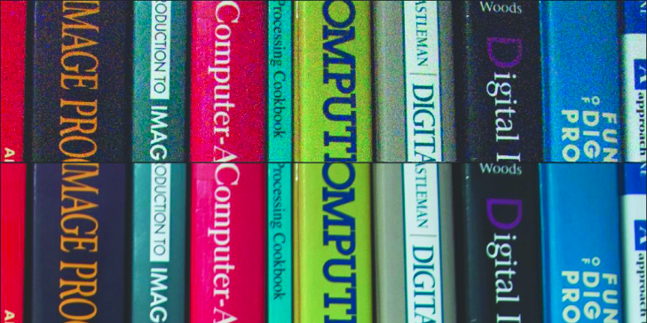
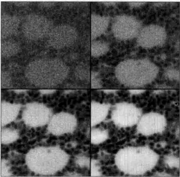
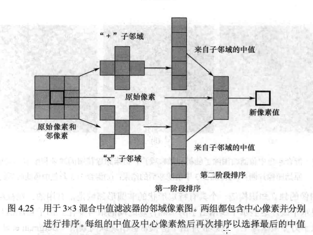
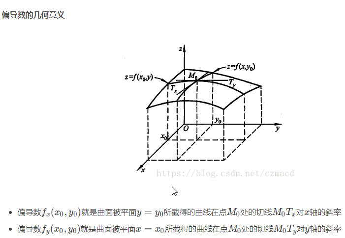
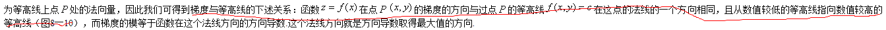

# 特征提取与图像处理（第二版）读书笔记

幅度描述的是每个频率分量的总量，而相位描述的是频率分量产生的时序（timing）

**相位谱：**基础的正弦波A.sin(wt+θ)中，振幅，频率，相位缺一不可，不同相位决定了波的位置，所以对于频域分析，仅仅有频谱（振幅谱）是不够的，我们还需要一个相位谱

复数的物理意义：

卷积的物理含义：
卷积的几个现实例子:蒸馒头/复利/打脸(参考知乎)
滤波器原理：

卷积是

一个信号p1(t)和另外一个信号p2(t)的卷积可以通过积分计算：

这是系统理论的基础，激励p1和系统响应p2 反转系统响应的时间轴得到记忆函数？？？？？

采样定理是美国电信工程师H.奈奎斯特在1928年提出的，在数字信号处理领域中，采样定理是连续时间信号（通常称为“模拟信号”）和离散时间信号（通常称为“数字信号”）之间的基本桥梁。该定理说明采样频率与[信号频谱](https://baike.baidu.com/item/%E4%BF%A1%E5%8F%B7%E9%A2%91%E8%B0%B1/8084448)之间的关系，是[连续信号](https://baike.baidu.com/item/%E8%BF%9E%E7%BB%AD%E4%BF%A1%E5%8F%B7/6597074)[离散化](https://baike.baidu.com/item/%E7%A6%BB%E6%95%A3%E5%8C%96/10501557)的基本依据。 它为采样率建立了一个足够的条件，该采样率允许离散采样序列从有限带宽的连续时间信号中捕获所有信息。

-------

**离散傅里叶变换**
为什么会出现离散傅里叶变化，具体可以参考如下两篇文章，关键点摘抄如下：

1. [如何通俗地解释什么是离散傅里叶变换？](https://www.zhihu.com/question/21314374)
***DTFT（离散时间傅里叶变换）是给人用的，DFT（离散傅里叶变换）是给机器用的，DFT是对DTFT的频域采样。***
2. [深入理解FT，DTFT，DFT 之间的关系](https://blog.csdn.net/weixin_40679412/article/details/80426463)

思考离散傅里叶变换怎么从一维推导到二维

数字图像处理.John C.Russ(第六版) 中第6章关于傅里叶变换的可以好好看看
建立一个基础概念非常重要，比如使用简单图像导出我们熟悉的频率空间变换的功率谱显示，比如傅里叶变换和逆傅里叶变换对等等

--------

2019年2月17日学习小结：
今天主要是在搜索引擎上专门找图像的导数（求导）的意义：关注下这个小伙的博客(https://blog.csdn.net/saltriver?t=1)，里面应该有几篇文章可以详细参考下
有空的话可以看下数字图像处理第三版（冈萨雷斯）第十章中的内容

搜索：行人检测、人形检测、人体检测

参考如下资源汇总：https://blog.csdn.net/qq_26898461/article/details/48262957

当当上的书籍：http://product.dangdang.com/23942207.html

另外一个书籍：基于单目视觉的智能汽车行人检测技术研究

硕士论文：朱文佳-基于机器学习的行人检测关键技术研究 （可以在这里在线免费阅读：http://www.doc88.com/p-0611669997404.html   ）

行人检测资源参考：https://blog.csdn.net/dreamhigh_m/article/details/70618768

---------

2019年2月19日：
总结下从2月11日到2月18日学习到的内容，输出一些总结：主要是如下几个：
1. 讲下离散傅里叶变换出现的原因、意义
2. 讲下一次导数、二次导数在数字图像处理中的原理和应用场景（主要参考下2月17日总结中提到的系列博客文章，仿照他的写作方法写几篇，同时继续仿照此风格，多写一些文章）
3. 讲下边缘检测
4. 储备下行人检测的知识，为后续学习做准备
5. 看下滤波器相关的知识

-----------
从今天起还是专注读这几本教材，优先读《数字图像处理.John C.Russ(第六版) 》，原因是这本书中数学公式少，大量插图实例多，便于概念理解，全书总共约600页，计划每天读10页（要求每天都要有对应的输出），60天读完，每天统计偏差，19年2月19日先读下绪论和看下整体书籍的目录结构
第一天（2019.2.19)：绪论，讲解了为啥要熟悉人类视觉和印刷技术
>为使工作尽可能最佳,知道所处理的图像将用于何处是很重要的。对于视觉增强而言,这意味着要在一定程度上熟悉人类视觉过程,并了解观察者对图像中的哪些线索有反应。关于人类视觉的一章涉及了这些问题。由于许多图像是在复制或传输的情况下进行处理的,因此了解图像的印刷或显示过程也会有帮助。随着数码相机用户数量的剧增,图像的印刷技术发展得非常快,本书提供了最新的相关信息。

第二天（2019.2.20)：接着看绪论和第一章的内容，后面不再摘抄大面积书上的内容，主要改为在书上做标记为主
绪论：图像处理的两个目的：1）***视觉增强*** 改进图像，便于呈现给人类观察  2）***图像测量***：通常是获取科学数据的主要方法，测量图像，并定义、揭示其特征与结构。特征和结构包括***边缘、亮度、色彩或者是他们的组合***，这样便于识别图中的关键点，比如人脸识别、行人识别等
第一章：**人类依赖图像获取信息** 人类主要是视觉动物，往往通过视觉发展更多的技术，很多科学任务，比如外太空探索、深海勘探等，相机都是作为主要的部件，这些任务的成功与否，通常由返回的图像质量决定。
另外，讲解了摄像机的历史：
1）原始视频相机（管式相机）：不同强度的光进入荧光涂粉层， 在荧光体上产生自由电子，这些操作改变了局部涂层的电导率，因此当电子束扫描时，流向阳极的电流大小会随着局部的光强而变化。此种相机的缺点：电磁场或者静电场扫描束会产生一种失真的扫描，造成枕形失真、虚光和失焦；优点：空间分辨率非常高，荧光粉有一种类似于人眼的谱响应，即可看到从红到蓝的颜色，用特殊涂层对相机进行改装，可以在非常暗淡的光线下获取图像（如夜景、荧光显微镜）

2）CCD(电荷耦合器件)相机：管式相机基本被固态芯片相机取代，固态芯片相机最原始且最简单的形式是CCD，后来CCD传感器又被更廉价的CMOS传感器替代，CCD传感器则在高端应用领域有优势，具体可以参见书上内容

第三天（2019.2.21): 加班太晚，12点到才到家，今天无进展，落下的进度本周要完成，从周二开始算，到本周日的目标是要学习完成60页。

第四天（2019.2.22）：

**关于噪声的一些阐述：**
下图的显示了高ASA设置（高放大增益）对图像中随机像素变化的效果，图像上半部分ASA 1600，下半部分100，通过对比表明相机中较高增益产生了较大的随机噪声。

**图像加法的其中一个意义**
下图显示了一幅荧光显微图像,其中的一个视频帧示出了大量的统计噪声,这一噪声妨碍了我们分辨或测量所呈现的结构。对多个帧进行平均处理会收集更多的信号,并可增强信噪比,进而提升细节的可视性。

增加曝光量(增大曝光时间、镜头光圈或光照)会因为统计效果而降低噪声。质量的提升与所收集的光(或其他信号)的数量的平方根成正比。

第四天（2019.2.23）：主要看了第一章第12节高深度图像：
从海平面到珠穆朗玛峰以8位(256个值)编码的地表高程图,对应于100英尺/位;在这样的地形图上,佛罗里达的绝大部分地区与海平面就很难区分。使用2字节像素(65536个值)时,每位约表示6英寸,在地图上可以分辨沿多数街道的路肩。使用4字节像素(40亿个值),每位所对应的小于200μm,这时甚至可记录海滩上沙子的粗糙度。
接着看了彩色图像这一节，SEM（扫描电子显微镜）通常是一种严格的单色成像工具，书中讲了使用彩色图像的几个意义：
1、使用伪彩色，一般目的是将原本的黑白图像中的某些亮度着上色，凸显其特征，便于人工观察，另外一个原因是人类视觉能力分辨亮度细微差别的能力。
2、使用色彩来对多维信息进行丰富的编码，如色彩通常用于对表面高程着色(见第15章)。在科学可视化中,色彩用于速度、密度、温度、成分和许多其他并不明显的属性。这些属性通常与图像的特性无关,只是简单地利用人的能力来区分比灰度值更多的色彩。
第四天（2019.2.24）：主要看了第一章第15节色彩空间：
RGB HSI等色彩空间的转换关系，另外说到了LUT查找表将彩色图像降到256色
第五天（2019.2.26）：主要对第一章第15节到这一章节末尾书上的内容做下简单摘要
多幅图像：1）对同一区域使用多种不同波长得到的同一区域的不同卫星图2）时间序列图，用于跟踪天气系统的一系列卫星图像
体视法：从相同场景的稍微不同角度拍摄的两幅图像中也可以获得三维信息，人的双眼成像原理
人类视觉是比较性的。
今天进入第二章的学习：人类视觉
在数字图像处理的书籍中花一章讲解人类视觉有两个主要原因。首先,许多图像处理涉及提高图像中细节及特征的可见度,而这取决人们对从图像中所看到(及所忽略)的内容的一些理解。其次,在后续章节描述的用于图像处理和场景中目标检测的许多算法,或多或少都基于我们对人类视觉处理如何工作的理解。
人类90%到95%的信息通过眼睛获得
人类视觉的不少目的是识别，寻找食物，躲避猎物，引起配偶注意等
图像的特性或者特征是人类识别物体的标志
人类视觉根源的基本技术是比较，眼睛感知不到物体具体尺寸、测量不出来亮度和颜色的具体值
第六天（2019.2.27）：今天主要以阅读书籍上的内容为主，在pdf文档上做了很多红线记录
第七天（2019.2.28）：今天主要以阅读书籍上的内容为主，在pdf文档上做了很多红线记录
第八天（2019.3.1）：今天主要以阅读书籍上的内容为主，在pdf文档上做了很多红线记录，今天结束了书中第二章的阅读。
第九天（2019.3.2）：今天主要以阅读书籍上的内容为主，在pdf文档上做了很多红线记录，阅读了第三章中的大部分内容
第十天（2019.3.4）：今天的主要目标是结束第三章的学习，Haar函数小波变换没有看懂，后面有机会再研究下。
帧间差分法C+代码：https://blog.csdn.net/lijia0129/article/details/25034253
https://blog.csdn.net/xiao__run/article/details/76849908
第十一天（2019.3.5）：今天开始正式进入第四章的学习，终于要进入正题了
第一节首先讲了对比度扩展，比如偏暗色的图片可以通过将图片中最亮值和最暗值对应的亮度区间线性映射到更大的亮度区间（比如0到255最广灰度空间）来增加明暗对比度，从而来调亮整体的图片。
第二节讲了噪声是图像中的很大缺陷，对比度线性扩展也会使得噪声增加。对于随机噪声，对一定数量的帧取平均，可以提升图像的质量（技术上为信噪比）。另外，对于相机来说，更长的曝光时间，更小的信号放大增益可以减少图像噪声。
第三节讲解了领域平均法，领域平均也可以使用非方形值，对于较大的领域，近似的圆形比方形好。接着讲解了高斯核，从文中所讲来看，高斯核也没有解决边缘模糊的问题。对于此问题的解决方案貌似是：在第5章关于图像增强的介绍中,给出了负权重值围绕一个正的中心峰值的核的用法。这一改动的目的是锐化边缘,并避免因消除噪声所引起的一些模糊。
第十二天（2019.3.6）：第四节讲解了领域排序，其中最广泛使用的方法是中值滤波器，中值滤波器相对于权重相乘平均方法有两个主要优点：1）该方法不会降低或者模糊各阶的亮度差异，2）其次，与平均操作不同，中值滤波不会使得边界移位
混合中值为什么能保留被传统中值滤波删除的线或磨圆的角呢？参考下面的图，后续慢慢想下

第5节其他领域降噪方法提到了顶帽滤波器，在第6节中会更详细的讲解介绍该滤波器对于不同目的的用法
第十三天（2019.3.7）：今天主要学习第6节的内容，缺陷消除：最大熵和最大似然，这一节完全没有看懂，后面在互联网上再搜集相关知识点进行学习吧，这里有一句关键的后面可以深入研究的话是：基于熵的计算机密集型方法，可消除如噪声或图像模糊之类的人为缺陷。我们家有个摄像头的图像是比较模糊的，看看能不能用这种方法消除图像模糊。另外也可以百度搜索关键字“数字图像处理 去模糊”来检索相关资料：https://wenku.baidu.com/view/955bd8347f21af45b307e87101f69e314332fa28.html
第十四天（2019.3.9）：今天主要以阅读书籍上的内容为主，在pdf文档上做了很多红线记录
第十五天（2019.3.13）：今天进入第5章的学习，空间域图像增强，直方图均衡看了书本上的公式完全不理解，参考了如下的帖子豁然开朗
https://www.cnblogs.com/tianyalu/p/5687782.html
第十六天（2019.3.17）：今天接着进行第5章的学习，重点学习了拉普拉斯算子和锐化算子。
提高细节和边缘可见性的一种更常用方法是反锐化掩模，书中的讲解加上下面一篇文档的参考可以更好地说明此方法的原理http://blog.sina.com.cn/s/blog_5a69abfb0101fsgh.html
线性反锐化掩模（UnSharp Masking，UM）算法。首先将原图像低通滤波后产生一个钝化模糊图像，将原图像与这模糊图像相减得到保留高频成份的图像，再将高频图像用一个参数放大后与原图像叠加，这就产生一个增强了边缘的图像。最初将原图像通过低通滤波器后，因为高频成份受到抑制，从而使图像模糊，所以模糊图像中高频成份有很大削弱。将原图像与模糊图像相减的结果就会使f(x、y)的低频成份损失很多，而高频成份较完整地被保留下来。因此，再将高频成份的图像用一个参数放大后与原图像f(x、y)叠加后，就提升了高频成份，而低频成份几乎不受影响。
第十七天（2019.3.18）：今天主要是复习之前学习到的内容，同时查下互联网上关于梯度的一些概念，参考这篇文档：方向导数与梯度http://netedu.xauat.edu.cn/jpkc/netedu/jpkc/gdsx/homepage/5jxsd/51/513/5308/530807.htm
很多时候要考虑多元函数沿任意方向的变化率，那么就引出了方向导数
各种算子的如何推导出来的参考如下文章：梯度与Roberts、Prewitt、Sobel、Lapacian算子
https://blog.csdn.net/swj110119/article/details/51777422
第十八天（2019.3.19）：今天主要是思考导数的几何含义，尤其是要弄明白三维空间中梯度的含义
参考下这篇文档：https://blog.csdn.net/czmacd/article/details/81178650 貌似下面的这个图可以稍微给点灵感

第十九天（2019.3.20）：关于梯度我还要在写一篇专题贴，介绍从二维函数的导数到三维引出方向导数，以及推演出来了方向导数沿梯度方向时值最大，另外，同时推导出梯度和等高线的关系

第二十天（2019.3.21）：这里遗留了5,8节纹理和5.9节分形的简单介绍没有细看，现在也看不懂，等到后面的章节详细讲了这两部分内容之后再看吧
另外，图像相减的意义理解了，但是图像相乘和相除能干啥还是看不懂啊，作为遗留问题吧
另外，主成分分析也作为遗留问题后续继续研究

第二十一天（2019.3.22）：今天开始进行第六章的学习，频率空间中的图像处理，这里面很多简单的图像都具备启发式
第二十二天（2019.3.23）：今天继续进行第六章的学习，要搞明白相位的物理含义；另外需要搞明白什么是衍射图样，它为啥会丢失相位信息
第二十三天（2019.3.24）：最近要弄清楚怎么从一维傅里叶变换推导出二维傅里叶变换以及相位的物理含义；
先找几个可以画数学图形的软件，这样便于学习一些抽象的概念，参考：http://www.360doc.com/content/15/0318/22/55856_456286702.shtml
从这个帖子里面提取一些信息是：计算机系的一般觉得python的matplotlib画出来的图像比较好（相比mathmaticas或者matlab等），同时指出matplotlib 3维绘制效果差点，有性能方面的原因，可能也有图像不够精细等各方面的原因吧，建议3D绘图使用mayavi这个库比较好。
这里有个帖子讲到了相位，负频率的物理含义，挺通俗的，可以看下：
https://www.zhihu.com/question/20977844/answer/66532717
傅立叶变换的确有明确的物理意义：把一个信号（时间轴上从负无穷到正无穷）分解为无数个角速度不同（遍历所有 实数）的圆周运动（该圆周运动发生在复平面）。所以，题主问的傅立叶变换的相位是什么含义？就是在t=0时刻，角速度为w的圆周运动所在的弧度。  另外一个让很多初学者百撕不得其解的 问题：傅立叶变换的负频率有什么含义？  答案是：正频率代表了逆时针的圆周运动，负频率代表了顺时针的圆周运动。就这么简单。  所以，一个实函数的傅立叶分解，必然是一对（或无数对）频率正负相反的圆周运动，加起来把虚数部分抵消了，只剩下实数部分。
第二十四天（2019.3.25）：今天继续弄清楚怎么从一维傅里叶变换推导出二维傅里叶变换，下面这篇文章从数学公式上进行了推导，写的挺不错，可以参考
https://www.cnblogs.com/TaigaCon/p/5152084.html
另外，参考下二维傅里叶变换的性质（可分离性、周期性和共轭性等）
https://blog.csdn.net/thecentry/article/details/80709593
第六章依然遗留了关于分形相关的知识，待到第十五章详细介绍分形时再做进一步学习。
第二十五天（2019.3.26）：今天继续学习第6章，卷积&去卷积等，去卷积着重讲了怎么去除模糊，可以重点参考下。
第二十六天（2019.3.27）：今天学习模板匹配和相关、自相关等知识，其中的自相关部分完全没看懂，后续有机会再看下。